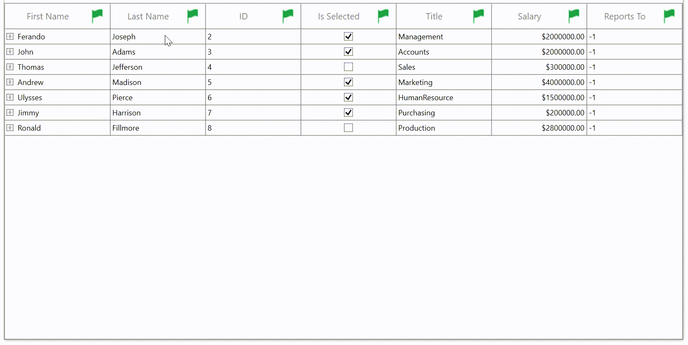

# How to change the default filter icon as an image in WPF TreeGrid (SfTreeGrid)?

[WPF TreeGrid](https://www.syncfusion.com/wpf-controls/treegrid) (SfTreeGrid) does not provide direct support for changing the default filter icon as an image. You can change the default filter icon as an image by overriding the [FilterToggleButton](https://help.syncfusion.com/cr/wpf/Syncfusion.UI.Xaml.Grid.FilterToggleButton.html) and defining the image instead of the path and loading the **BitmapImage** based on the filtered states.

```XML

<Style TargetType="syncfusion:FilterToggleButton">
     <Setter Property="Background" Value="Transparent" />
     <Setter Property="Height" Value="14" />
     <Setter Property="IsTabStop" Value="False" />
     <Setter Property="Width" Value="20" />
     <Setter Property="Foreground" Value="Gray" />
     <Setter Property="Margin" Value="3" />
     <Setter Property="Template">
         <Setter.Value>
             <ControlTemplate TargetType="syncfusion:FilterToggleButton">
                 <Grid>
                     <VisualStateManager.VisualStateGroups>
                         <VisualStateGroup x:Name="CommonStates">
                             <VisualState x:Name="Normal" />
                             <VisualState x:Name="MouseOver" />
                             <VisualState x:Name="Pressed" />
                             <VisualState x:Name="Disabled" />
                         </VisualStateGroup>
                         <VisualStateGroup x:Name="FilterStates">
                             <VisualState x:Name="Filtered">
                                 <Storyboard>
                                     <ObjectAnimationUsingKeyFrames Storyboard.TargetName="PART_FilterToggleButtonIndicator" Storyboard.TargetProperty="Source">
                                         <DiscreteObjectKeyFrame KeyTime="0">
                                             <DiscreteObjectKeyFrame.Value>
                                                 <!--Load the image for filtered state in FilterToggleButtonIndicator-->
                                                 <BitmapImage  UriSource="Images/Filtered.png" />
                                             </DiscreteObjectKeyFrame.Value>
                                         </DiscreteObjectKeyFrame>
                                     </ObjectAnimationUsingKeyFrames>
                                 </Storyboard>
                             </VisualState>
                             <VisualState x:Name="UnFiltered">
                                 <Storyboard>
                                     <ObjectAnimationUsingKeyFrames Storyboard.TargetName="PART_FilterToggleButtonIndicator" Storyboard.TargetProperty="Source">
                                         <DiscreteObjectKeyFrame KeyTime="0">
                                             <DiscreteObjectKeyFrame.Value>
                                                 <!--Load the image for unfiltered state in FilterToggleButtonIndicator-->
                                                 <BitmapImage  UriSource="Images/UnFiltered.png" />
                                             </DiscreteObjectKeyFrame.Value>
                                         </DiscreteObjectKeyFrame>
                                     </ObjectAnimationUsingKeyFrames>
                                 </Storyboard>
                             </VisualState>
                         </VisualStateGroup>
                     </VisualStateManager.VisualStateGroups>
                     <Border Width="{TemplateBinding Width}"
                         Height="{TemplateBinding Height}"
                         Background="{TemplateBinding Background}">
                         <!--Load the image in FilterToggleButtonIndicator-->
                         <Image Name="PART_FilterToggleButtonIndicator" Height="8" Width="8"
                                Source="Images/UnFiltered.png"              />
                     </Border>
                 </Grid>
             </ControlTemplate>
         </Setter.Value>
     </Setter>
 </Style>

```


Take a moment to peruse the [WPF TreeGrid – Filtering](https://help.syncfusion.com/wpf/treegrid/filtering) documentation, to learn more about filtering with code examples.
